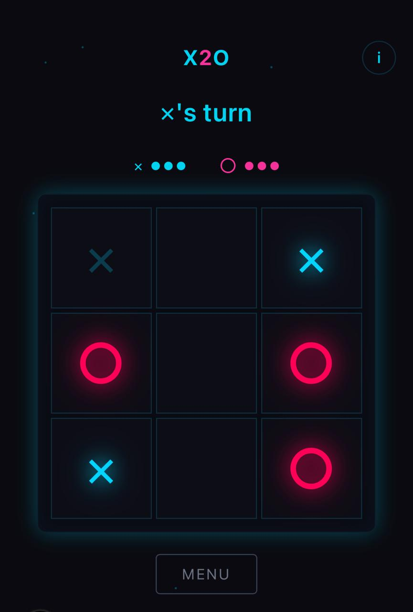

# X2O

```
╔═══════════════════════════════════════════════════════════════════════════════╗
║                                                                               ║
║     ██╗  ██╗ ██████╗   ██████╗     ╔═══╦═══╦═══╗                              ║
║     ╚██╗██╔╝ ╚════██╗ ██╔═══██╗    ║ X ║   ║ O ║                              ║
║      ╚███╔╝   █████╔╝ ██║   ██║    ╠═══╬═══╬═══╣                              ║
║      ██╔██╗  ██╔═══╝  ██║   ██║    ║   ║ O ║   ║                              ║
║     ██╔╝╚██╗ ███████╗ ╚██████╔╝    ╠═══╬═══╬═══╣                              ║
║     ╚═╝  ╚═╝ ╚══════╝  ╚═════╝     ║ X ║   ║ X ║                              ║
║                                    ╚═══╩═══╩═══╝                              ║
║                                                                               ║
║              T I C - T A C - T O E   W I T H   A   T W I S T                  ║
║                                                                               ║
╚═══════════════════════════════════════════════════════════════════════════════╝
```

> Each player can only have **3 symbols** on the board. Place a 4th, and your oldest one vanishes.

## Demo

<p align="center">
  
</p>

## Rules

```
┌─────────────────────────────────────────────────────────────────┐
│  1. Players take turns placing X or O                           │
│  2. Each player can have MAX 3 symbols on the board             │
│  3. Placing a 4th symbol removes your OLDEST one                │
│  4. You CANNOT place on the square that just vanished           │
│  5. Get 3 in a row to win!                                      │
└─────────────────────────────────────────────────────────────────┘
```

## Quick Start

```bash
npm install
npm run dev
```

Open [http://localhost:3000](http://localhost:3000)

## Tech Stack

| Tech | Version |
|------|---------|
| Next.js | 16 |
| React | 19 |
| TypeScript | 5 |
| Tailwind CSS | 4 |

## Project Structure

```
src/app/
├── page.tsx              # Game state management
├── components/
│   ├── LandingPage.tsx   # Start screen
│   ├── GamePage.tsx      # Main game board
│   ├── Square.tsx        # Board cells
│   ├── LightningLine.tsx # Win animation
│   └── Particles.tsx     # Victory effects
└── constants.ts          # Game config
```

## License

MIT

---

<p align="center">
  <sub>Built with caffeine and recursion</sub>
</p>
